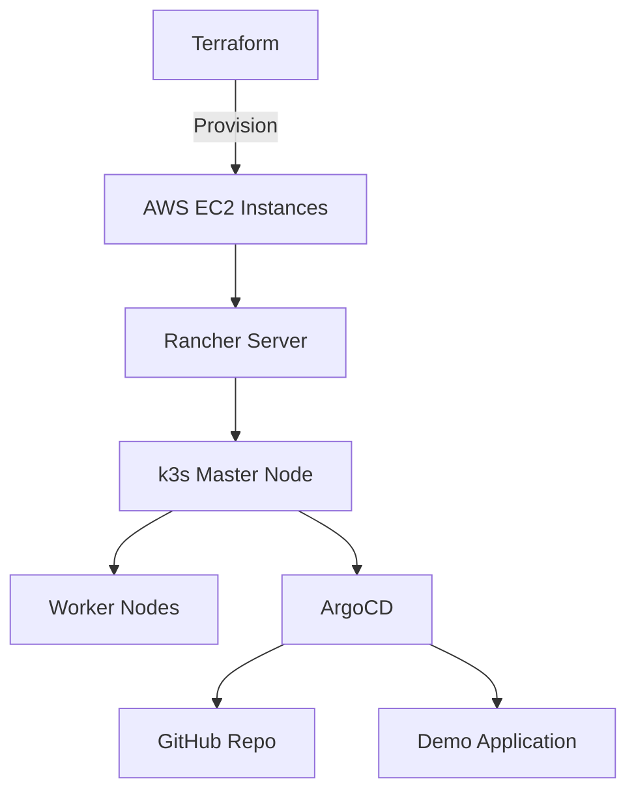

# 🚀 GitOps with Rancher, k3s, and ArgoCD

This project demonstrates how to provision infrastructure with **Terraform**, set up a lightweight **Kubernetes cluster (k3s)** managed by **Rancher**, and enable a **GitOps workflow** with **ArgoCD**.  

The goal is to show how DevOps teams can automate infrastructure, deploy applications via Git, and achieve **self-healing & continuous delivery** in the cloud.

---

## 📌 Project Overview

- **Cloud Provider:** AWS (EC2, VPC, Security Groups)  
- **Orchestration:** Rancher + k3s  
- **GitOps Tool:** ArgoCD  
- **IaC:** Terraform  
- **Automation Scripts:** Bash  
- **Demo App:** Simple Nginx-based web app  

✅ Fully automated infrastructure provisioning  
✅ Kubernetes cluster managed by Rancher  
✅ GitOps deployment pipeline with ArgoCD  
✅ Drift detection & self-healing demonstration  

---

 ## ⚡ Features
- **Infrastructure as Code (IaC):** Automated AWS infrastructure with Terraform.
- **Automated Rancher Setup:** Rancher is installed automatically on the master node.
- **Automated ArgoCD Setup:** ArgoCD is deployed automatically into the cluster.
- **GitOps Workflow:** Applications deployed & updated automatically via ArgoCD.
- **Self-Healing:** ArgoCD restores drifted resources to match Git.
- **Scalable Setup:** Easily extendable to multiple environments.

## 🔑 Prerequisites
- AWS Account with credentials configured
- Terraform installed
- kubectl installed
- GitHub repo for storing manifests
---

## 🏗️ Project Architecture

